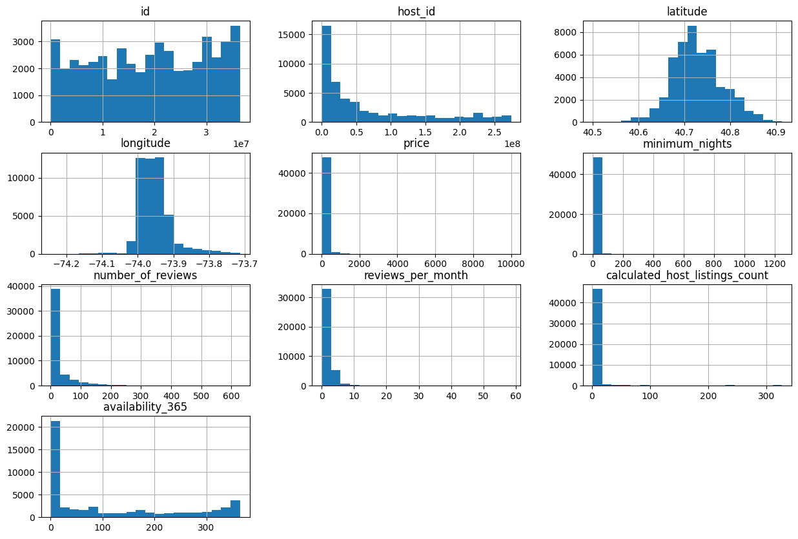
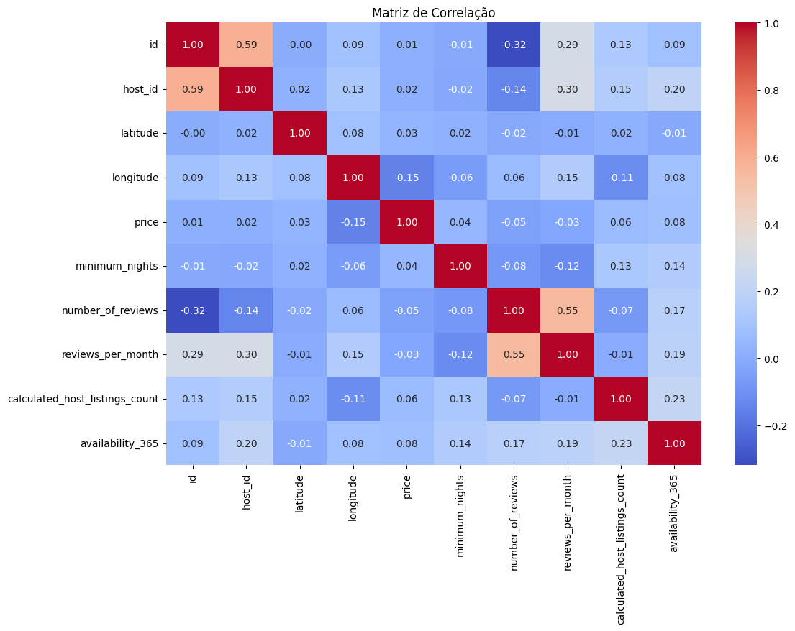
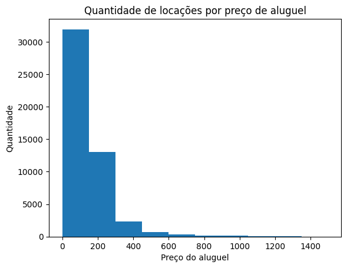
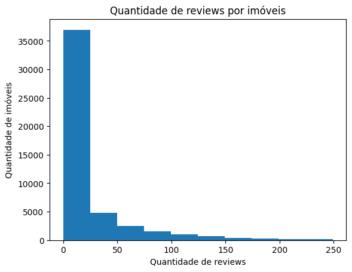
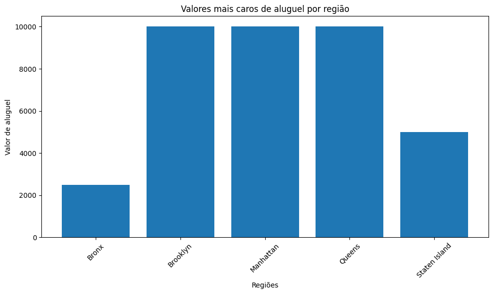
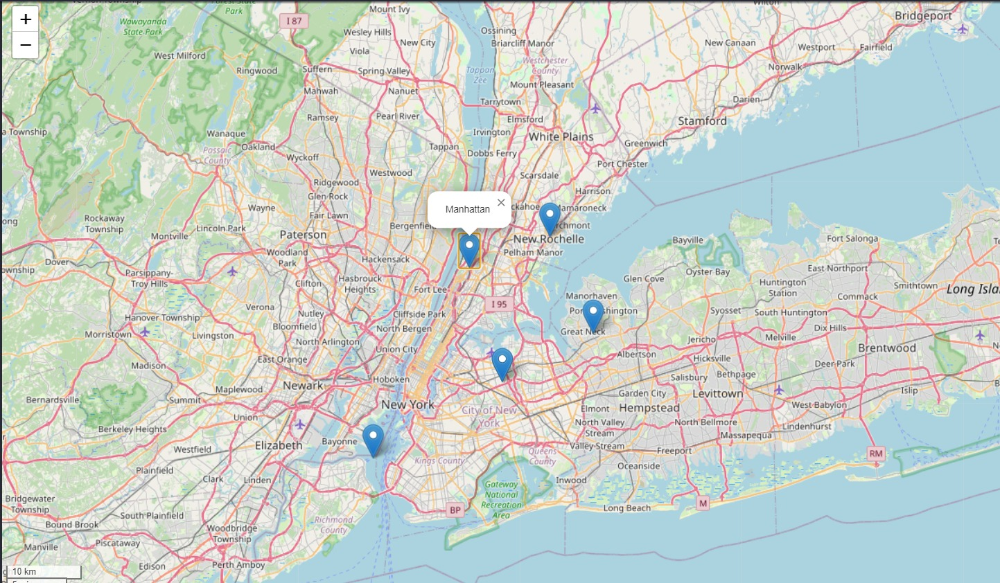
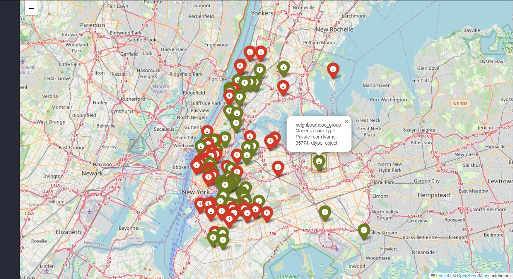

## Introdução

Este é um projeto end-to-end de Data Science para análise de dados. A análise auxilia na tomada de decisão para um projeto de expansão da empresa Aibnb em Nova York e o foco foi em responder algumas perguntas cruciais realizadas pelo CEO que dara suporte às ações dos setores comerciais e de marketing. Este projeto faz parte da "Comunidade DS", que é um ambiente de estudo que promove o aprendizado, execução, e discussão de projetos de Data Science.

Obs.: Importante observar que este cenário é usados com intuito de aprendizagem.

### Plano de desenvolvimento do projeto Data Science

O projeto foi desenvolvido com objetivo de tornar mais assertiva a tomada de decisão, com base em dados históricos da empresa que respondam questionamentos fundamentados na experiência e vivência do negócio.

#### Planejamento

1. Descrição do problema de negócio
2. Plano de solução
3. Resolução dos problemas apresentados
4. Conclusão

### 1. Descrição do problema de negócio

#### 1.1 Objetivo da empresa

O Airbnb gostaria de realizar um projeto de expansão de seus negócios na cidade de Nova York (NY), com intuito de aumento de receita e visibilidade. 

#### 1.2 Problema de negócio

Esse projeto de expansão é muito importante para o Airbnb, mas também é muito arriscado. Qualquer decisão errada por parte do CEO pode levar a empresa a ter um prejuízo enorme. 

Para diminuir o risco desse projeto, o seu chefe pediu para auxiliar o CEO
da empresa, utilizando dados para responder algumas perguntas, que o
ajudarão a tomar melhores decisões comerciais e de marketing.

#### 1.3 As perguntas do CEO

1. Qual o valor médio do aluguel na cidade de Nova York?
2. Quais os nomes das regiões que existem na cidade de Nova York?
3. Qual o valor do aluguel diário mais caro da cidade de Nova York?
4. Quais são as categorias de imóveis que estão cadastradas dentro da base de dados da cidade de Nova York?
5. Quantos usuários (Hosts) únicos cadastrados existem dentro da base de dados da cidade de Nova York?
6. Como é a variação do preços dos imóveis em NY?
7. Existem mais imóveis baratos ou caros?
8. Qual a distribuição do número de Reviews? Existem imóveis com muitos e outro com poucos reviews?
9. Qual é o valor do aluguel (diária) mais caro de cada região da base de dados da cidade de Nova York?
10. Conseguimos saber onde estão localizados os imóveis com o valor do aluguel mais caro, na cidade de Nova York?
11. Conseguimos saber onde estão localizados os imóveis pelo seu tipo?

#### 1.4 Missão

Com as informações fornecidas, é necessário realizar uma análise prévia dos dados do Airbnb fornecidos da cidade de Nova York, responder as perguntas do CEO e muní-lo de informações úteis sobre as regiões na qual deseja expandir os negócios. Ou seja, tal ação vai entregar aos vendedores e ao time de marketing uma informação complementar sobre as áreas a serem disponibilizadas para aluguel, com maiores e menores valores, localização, imóveis de maior valor, quais os imóveis mais procurados e falados pelos clientes, entre outras informações.

### 2. Plano de solução

#### 2.1 Coleta de dados

- Entendimento dos dados disponibilizados no Kaggle (https://www.kaggle.com/datasets/dgomonov/new-york-city-airbnb-open-data)
- Coleta dos dados

#### 2.2 Análise de dados

### Inspeção dos dados

| **Atributos** |  **Descrição**  |
| ------------------- | ------------------- |
| id | Identificação única para cada listagem |
| name |  Nome do espaço anunciado |
| host_id|  Identificação única do anfitrião (host) do espaço |
| host_name |  Nome do anfitrião (host) |
| neighbourhood_group |  Grupo de bairro. Indica a área geral da cidade (por exemplo, Manhattan, Brooklyn) |
| neighbourhood |  Bairro específico onde está localizado o espaço |
| latitude |  Latitude do espaço |
| longitude |  Longitude do espaço |
| room_type |  Tipo de espaço (por exemplo, quarto privado, apartamento inteiro) |
| price |  Preço do aluguel por noite |
| minimum_nights |  Número mínimo de noites para reservar |
| number_of_reviews |  Número total de avaliações que o espaço recebeu |
| last_review |  Data da última avaliação recebida |
| reviews_per_month |  Média de avaliações recebidas por mês |
| calculated_host_listings_count |  Número de listagens que o anfitrião possui |
| availability_365 |  Número de dias disponíveis dentro de 365 dias |

### Análise exploratória dos dados

* Resumo estatístico das variáveis

| Statistic | id            | host_id       | latitude  | longitude   | price      | minimum_nights | number_of_reviews | reviews_per_month | calculated_host_listings_count | availability_365 |
|-----------|---------------|---------------|-----------|-------------|------------|----------------|-------------------|-------------------|--------------------------------|------------------|
| count     | 48895         | 48895         | 48895     | 48895       | 48895      | 48895          | 48895             | 38843             | 48895                          | 48895            |
| mean      | 19017140      | 67620012      | 40.728949 | -73.952170  | 152.720687 | 7.029962       | 23.274466         | 1.373221          | 7.143982                       | 112.781327       |
| std       | 10983110      | 78610969      | 0.054530  | 0.046157    | 240.154170| 20.510550      | 44.550582         | 1.680442          | 32.952519                      | 131.622289       |
| min       | 2539          | 2438          | 40.499790 | -74.244420  | 0.000000   | 1.000000       | 0.000000          | 0.010000          | 1.000000                       | 0.000000         |
| 25%       | 9471945       | 7822033       | 40.690100 | -73.983070  | 69.000000  | 1.000000       | 1.000000          | 0.190000          | 1.000000                       | 0.000000         |
| 50%       | 19677280      | 30793822      | 40.723070 | -73.955680  | 106.000000 | 3.000000       | 5.000000          | 0.720000          | 1.000000                       | 45.000000        |
| 75%       | 29152184      | 107434363     | 40.763115 | -73.936275  | 175.000000 | 5.000000       | 24.000000         | 2.020000          | 2.000000                       | 227.000000       |
| max       | 36487245      | 274321313     | 40.913060 | -73.712990  | 10000.000000| 1250.000000   | 629.000000        | 58.500000         | 327.000000                     | 365.000000       |

Nesta primeira análise, podemos obter os seguintes insights:

O preço médio gira em torno de U$152,00, os clientes ficam em média 7 noites hospedados, há em média 23 comentários por local de locação, dentre outros primeiros possíveis insights.

* Distribuição das variáveis

De acordo com a distribuição de cada variável, vemos que na latitude e longitude, há uma concentração entre 40.7 de latitude e 73.95 para longitude, ou seja, muito provável que os imóveis tem uma concentração em algumma região específica. Seguindo a mesa linha de raciocínio, vemos um concentração nos valores de preço de aluguel, indicando que há semelhança entre os preços. Vemos o mesmo na quantidade de comentários por mês, na qual há um concentração de comentários nos primeiros meses após o uso, o que corrobora com a primeira análise realizada. 

* Correlação de variáveis

Nota-se que há pouco influência de resposta de acordo com a combinação de cada variável numérica.

### Preparação dos dados para responder as perguntas do CEO

### 3. Respondendo perguntas

1. Qual o valor médio do aluguel na cidade de Nova York?

* O valor médio de alugueis é de U$ 152.72.

_________________________________

2. Quais os nomes das regiões que existem na cidade de Nova York?

* Brooklyn, Manhattan, Queens, Staten Island e Bronx.

_________________________________

3. Qual o valor do aluguel diário mais caro da cidade de Nova York?

* O valor de aluguel mais caro é de U$ 10000.

_________________________________

4. Quais são as categorias de imóveis que estão cadastradas dentro da base de dados da cidade de Nova York?

* Existem 3 tipos de categorias: Quarto privativo, Casa/apto inteiro e Quarto compartilhado.

_________________________________

5. Quantos usuários (Hosts) únicos cadastrados existem dentro da base de dados da cidade de Nova York?

* Há 37457 usuários distintos.

_________________________________

6. Como é a variação do preços dos imóveis em NY?

* Dado o valor médio de aluguel, há uma variação de aproxiadamente U$240.15.

_________________________________

7. Existem mais imóveis baratos ou caros?

* Existe mais de 30.000 imóveis com valor até U$100.00

_________________________________

8. Qual a distribuição do número de Reviews? Existem imóveis com muitos e outro com poucos reviews?

* Existem mais de 35.000 imóveis com até 25 avaliações

_________________________________

9. Qual é o valor do aluguel (diária) mais caro de cada região da base de dados da cidade de Nova York?

| Bairro        | Preço   |
|---------------|---------|
| Bronx         | U$ 2500 |
| Brooklyn      | U$ 10000|
| Manhattan     | U$ 10000|
| Queens        | U$ 10000|
| Staten Island | U$ 5000 |

_________________________________

10. Conseguimos saber onde estão localizados os imóveis com o valor do aluguel mais caro, na cidade de Nova York?

_________________________________

11. Conseguimos saber onde estão localizados os imóveis pelo seu tipo?

_________________________________

### 4. Conclusão

Este projeto foi desenvolvido simulando um contexto do mundo real, na qual após essas questões respondidas ao CEO da empresa, espera-se maior segurança na tomada de decisão, dado que foi paltado em informações históricas que a empresa colheu e também feeling de negócio que foi direcionado pelas perguntas apontadas.

